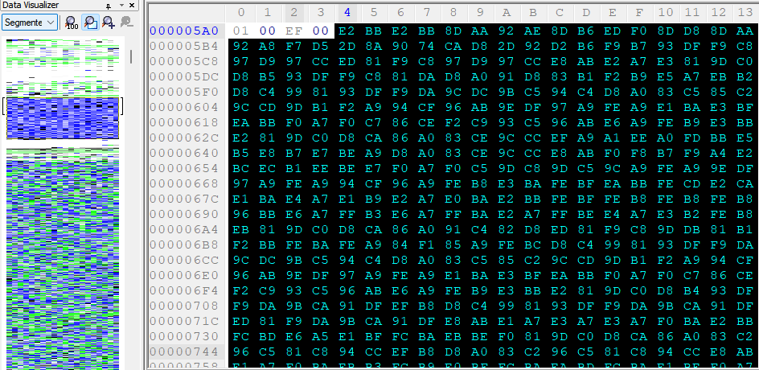
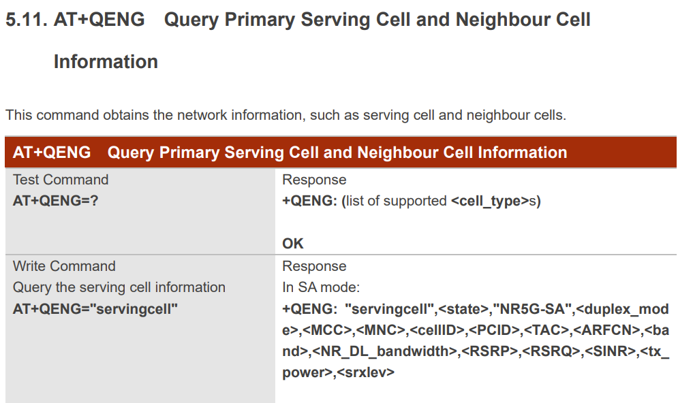
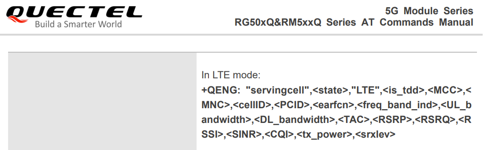
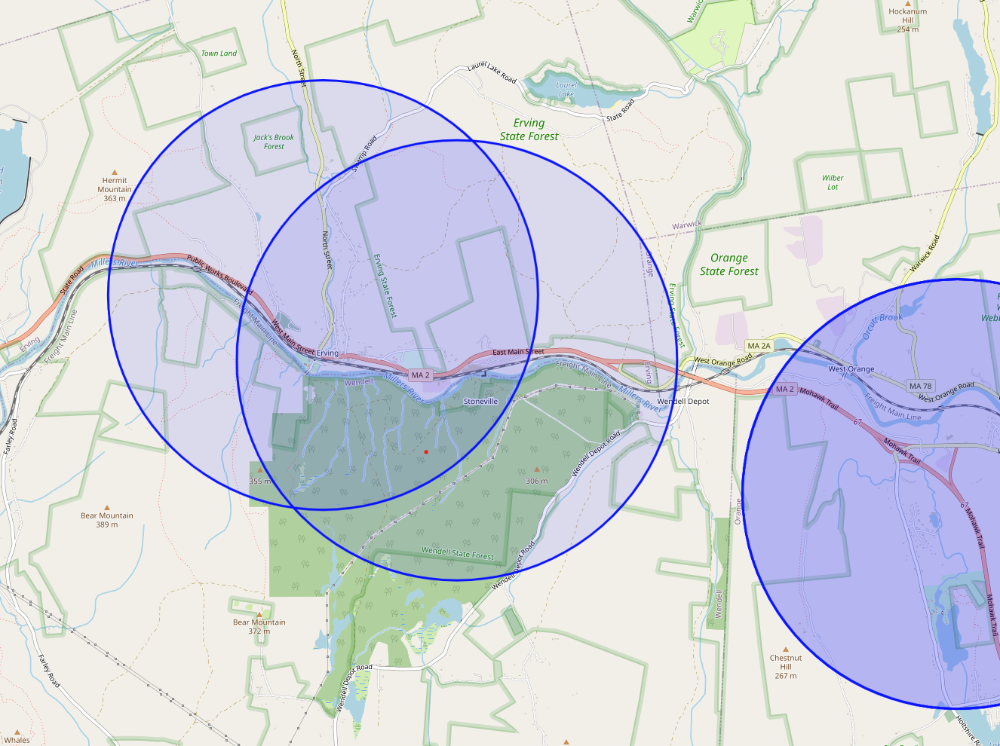
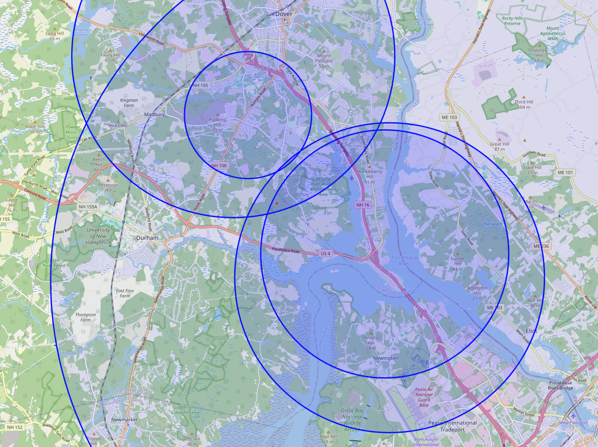

# Revealyx

Reveal the location Reconyx trail cameras that leverage the LTE modem for remote picture uploads.

The winner of Project Skydrop used his meteorological background combined with time, temperature and light data to narrow down possible locations of the treasure. After the trophy was found, the game runners removed the temperature from the images, but left it in the EXIF metadata. Once tipped off to that, they then removed it from the metadata as well.

At that point, the game seemed secure.

As it turns out, there was damming information hidden deep within the image metadata that allows for extremely precise triangulation of the Reconyx trail cameras used in this hunt.

# Known Reconyx EXIF Tags

Exiftool has some documentation on the known tags for Reconyx cameras: https://exiftool.org/TagNames/Reconyx.html. For the LTE cameras used in Project Skydrop, there exists some additional data which is not documented here.

In the "MakerNote" tag, at offset 970, there is a 1024 byte buffer of data that has a low/mid level of entropy, yet the MSB of each byte is set (with the exception of a couple, likely due to a bug in the printing by the firmware).



## LTE Band 4, Verizon

```plaintext
50,4,3,3,3D04,-81,-12,-51,12,-
OK
AT+COPS?
+COPS: 0,1,"VzW",7
OK
AT+QNWINFO
+QNWINFO: "FDD LTE","311480","LTE BAND 4",2250
OK
?AT+QIACT?
+QIACT: 3,1,1,"100.90.42.255"
OK
AT+QIDNSCFG=3
+QIDNSCFG: 3,"198.224.186.135","198.224.187.135"
OK
_Q_!@%<AT+CEREG?
+CEREG: 0,1
OK
>AT+CSQ
+CSQ: 30,99
OK
AT+QNWINFO
+QNWINFO: "FDD LTE","311480","LTE BAND 4",2250
OK
AT+QENG="servingcell"
+QENG: "servingcell","NOCONN","LTE","FDD",311,480,F0A317,320,2250,4,3,3,3D04,-83,-8,-56,23,41
OK
AT+COPS?
+COPS: 0,1,"VzW",7
OK
AT+QNWINFO
+QNWINFO: "FDD LTE","311480","LTE BAND 4",2250
OK
?AT+QIACT?
+QIACT: 3,1,1,"100.90.42.255"
OK
AT+QIDNSCFG=3
+QIDNSCFG: 3,"198.224.186.135","198.224.187.135"
OK
MBL_0095.JPG_Qhttps://cell.reconyx.com/api/images/
OK
AT+QHTTPPOSTFILE="RAM:temp.dat",120
OK
_Q_K
+QHTTPPOSTFILE: 0,200,0
AT+QFDEL="RAM:temp.dat"
OK
TX7_!@%<AT+CEREG?
+CEREG: 0,1
OK
>AT+CSQ
+CSQ: 30,99
OK
AT+QNWINFO
+QNWINFO: "FDD LTE","311480","LTE BAND 4",2250
OK
AT+QENG="servingcell"
+QENG: "servingcell","NOCONN","LTE","FDD",311,480,F0A30D,319,22
```

## LTE Band 2, AT&T

```plaintext
+QIACT?
+QIACT: 1,1,1,"10.129.55.173"
OK
AT+QIDNSCFG=1
+QIDNSCFG: 1,"100.121.11.10","100.122.11.10"
OK
MBL_1641.JPG+QFUPL: 274347,f5d9
OK
AT+QHTTPURL=36,30
CONNECT
https://cell.reconyx.com/api/images/
OK
AT+QHTTPPOSTFILE="RAM:temp.dat",120
OK
_Q0,410,FE2909,481,675,2,4,4,403,-93,-10,-64,21,36
OK
AT+COPS?
+COPS: 0,1,"AT&T",7
OK
AT+QNWINFO
+QNWINFO: "FDD LTE","310410","LTE BAND 2",675
OK
?AT+QIACT?
+QIACT: 1,1,1,"10.129.55.173"
OK
AT+QIDNSCFG=1
+QIDNSCFG: 1,"100.121.11.10","100.122.11.10"
OK
MBL_1640.JPG_Q_K+QFUPL: 270313,671a
OK
AT+QHTTPURL=36,30
CONNECT
https://cell.reconyx.com/api/images/
OK
AT+QHTTPPOSTFILE="RAM:temp.dat",120
OK
_Q_K
+QHTTPPOSTFILE: 0,200,0
AT+QFDEL="RAM:temp.dat"
OK
TX18_!@%<AT+CEREG?
+CEREG: 0,1
OK
>AT+CSQ
+CSQ: 25,99
OK
AT+QNWINFO
+QNWINFO: "FDD LTE","310410","LTE BAND 2",675
OK
AT+QENG="servingcell"
+QENG: "servingcell","NOCONN","LTE","FDD",310,410,FE2909,481,675,2,4,4,403,-96,-6,-64,16,34
OK
AT+COPS?
+COPS: 0,1,"AT&T",7
OK
AT+QNWINFO
+QNWINFO: "FDD LTE","310410","LTE BAND 2",675
OK
?AT
```

The response to the `AT+QENG` command appeared to contain a lot of information. Using the documentation by the LTE Modem manufacturer, Quectel, the values logged are tower specific identifiers: MCC, MNC, TAC, and CellID


# LTE Modem





```
+QENG: "servingcell","NOCONN","LTE","FDD",311,480,F0A30D,319,2250,4,3,3,3D04,-79,-8,-54,16,44
```

# Opencellid

Given the tower identifiers, querying opencellid.org returns the coordinates of the tower as well as its range:

```
**MCC**: 311  
**MNC**: 480  
**LAC / TAC**: 15620  
**CID**: 15770381  
**Radio Type**: LTE

**Latitude**: 43.186111  
**Longitude**: -70.893631  
**Range**: 2545 m  
  
_3_ measurements  
**Created**: 2017-02-27T08:08:44.000Z  
**Updated**: 2017-04-15T10:15:59.000Z

https://opencellid.org/#zoom=18&lat=43.186267&lon=-70.893617
```

At this point the towers and cell radius can be mapped and the locations of the cameras should appear in the overlap. 

# Calculated Locations

## Original trophy location



## Prize Jar



# Usage

```bash
❯ python revealyx/revealyx.py
Extracting cell tower data... ━━━━━━━━━━━━━━━━━━━━━━━━━━━━━━━━━━━━━━━━ 100% 0:00:00
Total images: 7
Unique data chunnks: 7
Geo-locating towers... ━━━━━━━━━━━━━━━━━━━━━━━━━━━━━━━━━━━━━━━━ 100% 0:00:00
Extracting cell tower data... ━━━━━━━━━━━━━━━━━━━━━━━━━━━━━━━━━━━━━━━━ 100% 0:00:00
Total images: 3
Unique data chunnks: 3
Geo-locating towers... ━━━━━━━━━━━━━━━━━━━━━━━━━━━━━━━━━━━━━━━━ 100% 0:00:00
Tower Details:
MCC: 311 MNC: 480 TAC: 16898 CellID: 17003523
MCC: 311 MNC: 480 TAC: 15620 CellID: 15770391
MCC: 311 MNC: 480 TAC: 15620 CellID: 15770381
MCC: 310 MNC: 410 TAC: 1027 CellID: 16656649
MCC: 311 MNC: 480 TAC: 15620 CellID: 15770390
MCC: 311 MNC: 480 TAC: 15620 CellID: 15770380
MCC: 311 MNC: 480 TAC: 15620 CellID: 15770370
MCC: 310 MNC: 410 TAC: 1027 CellID: 16656650
MCC: 310 MNC: 410 TAC: 1027 CellID: 16656649
MCC: 310 MNC: 410 TAC: 1027 CellID: 16656813
Saved map to final_map_.html
```